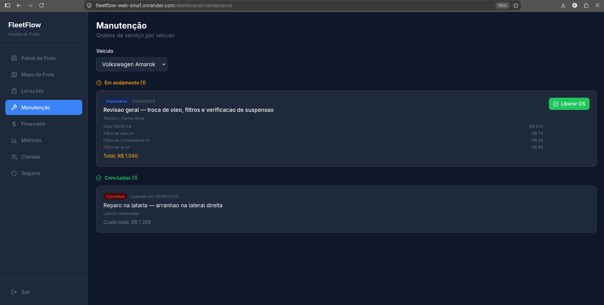
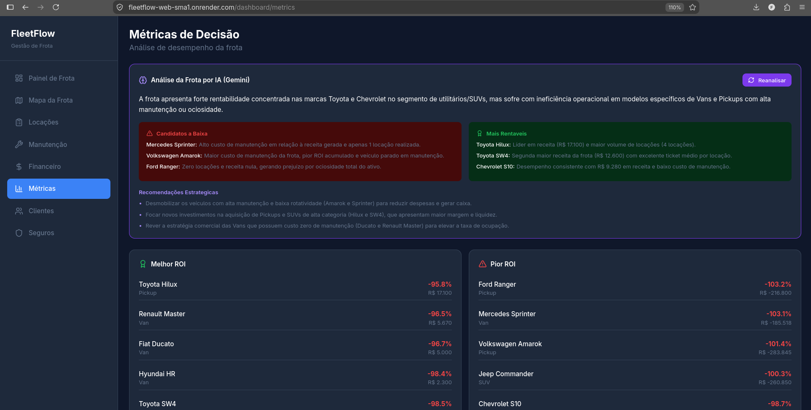
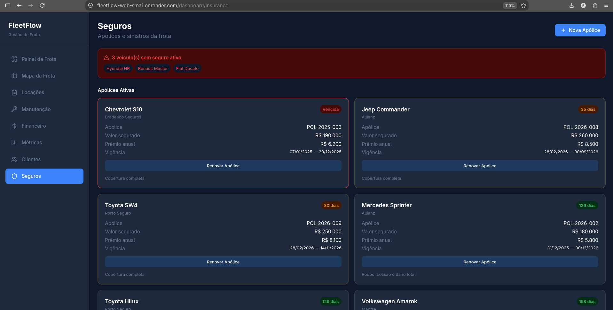
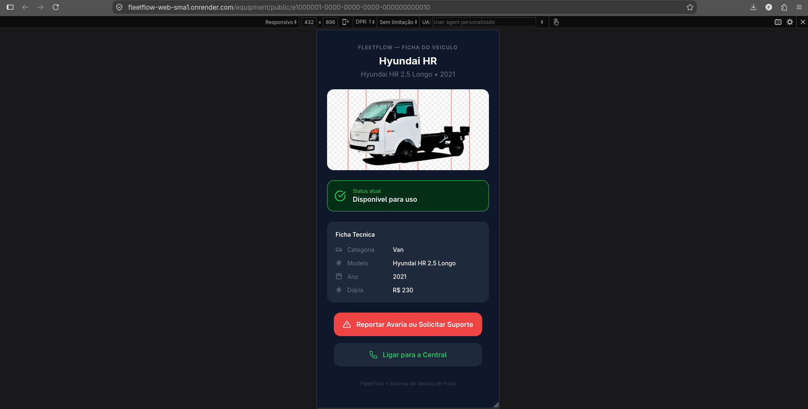

<div align="center">

# FleetFlow

**Sistema de Gestão de Frota de Veículos para Locação**

[](https://github.com/fernandogrimello/fleetflow/actions/workflows/ci.yml)
[](LICENSE)
[](https://nodejs.org)
[](https://nextjs.org)
[](https://www.typescriptlang.org)
[](https://www.postgresql.org)
[](https://aistudio.google.com)

</div>

---

## 📱 Acesso Mobile

O sistema é responsivo e pode ser acessado pelo smartphone. Para uma experiência completa recomendamos o uso em **desktop** — telas como o mapa da frota, métricas e financeiro foram projetadas para telas maiores.

---

## ⚠️ Aviso Importante

Este é um **projeto de portfólio com fins exclusivamente demonstrativos**. Foi desenvolvido para evidenciar conhecimentos técnicos em arquitetura full-stack, boas práticas de desenvolvimento, testes automatizados e deploy em nuvem.

Para um sistema profissional e comercial real, seria necessário implementar diversas funcionalidades adicionais, como: autenticação OAuth, notificações em tempo real (WebSocket), relatórios em PDF, integração com sistemas de pagamento, multi-tenancy, auditoria completa, backup automatizado, monitoramento de infraestrutura, entre muitas outras. O FleetFlow representa o **início de um sistema**, não um produto finalizado.

---

## Sobre o Projeto

FleetFlow é um sistema full-stack de gestão de frota de veículos para empresas de locação. Cobre o ciclo de vida completo de cada veículo: da aquisição ao descarte, passando por locações, manutenções, seguros e análise de ROI.

O sistema inclui rastreamento GPS simulado com mapa interativo, análise preditiva por IA (Gemini 3.6 Flash), página pública via QR Code para operadores de pátio e alertas automáticos de hodômetro.

---

## Demo Online

**Acesse o sistema:** [https://fleetflow-web-sma1.onrender.com](https://fleetflow-web-sma1.onrender.com)

> ⏳ **Atenção:** O sistema utiliza o plano gratuito do Render. Após períodos de inatividade, o servidor pode levar até 50 segundos para acordar. Aguarde o carregamento completo da página antes de tentar fazer login.

**Credenciais de acesso:**
| Campo | Valor |
|-------|-------|
| E-mail | `admin@fleetflow.com.br` |
| Senha | `FleetFlow@2026` |

**Infraestrutura de produção:**
- **Frontend:** Render (plano gratuito) — [fleetflow-web-sma1.onrender.com](https://fleetflow-web-sma1.onrender.com)
- **Backend:** Render (plano gratuito) — [fleetflow-api-x73g.onrender.com](https://fleetflow-api-x73g.onrender.com)
- **Banco de dados:** Neon PostgreSQL (São Paulo) — plano gratuito

---

## Telas do Sistema

### Painel de Frota


### Mapa da Frota


### Manutenção


### Financeiro


### Métricas com IA


### Seguros


### QR Code Público


---

## Funcionalidades

| Módulo | Descrição |
|--------|-----------|
| Painel de Frota | Grid visual com fotos, badges de status, busca e filtros |
| Check-in / Check-out | Retirada e devolução de veículos com registro de condições |
| Manutenção | Preventiva e corretiva com OS, peças, custos e liberação |
| Financeiro | ROI por veículo: receita, custos, lucro líquido, downtime |
| Métricas | Rankings, taxa de ocupação, custo por categoria |
| Telemetria GPS | Mapa interativo, hodômetro, alertas e gatilho automático de OS |
| Seguros | Apólices, sinistros e alertas de vencimento |
| IA (Gemini) | Análise preditiva da frota e recomendações estratégicas |
| QR Code | Página pública com ficha técnica e abertura de chamado |
| Upload de Fotos | Galeria por veículo com armazenamento no Cloudinary |

---

## Stack

**Backend:** Node.js 20 + Express + TypeScript + Prisma 5 + PostgreSQL 16

**Frontend:** Next.js 16 + Tailwind CSS + TypeScript + React Leaflet

**IA:** Google Gemini 3.6 Flash

**Armazenamento:** Cloudinary (fotos dos veículos)

**Infra:** Docker + Docker Compose (local) · Render + Neon (produção)

**Testes:** Jest + Supertest (32 testes) · Playwright E2E (11 testes) · k6 Performance (4 cenários)

---

## Como Rodar Localmente

### Pré-requisitos

- [Node.js 20+](https://nodejs.org/en/download)
- [Docker Desktop](https://www.docker.com/products/docker-desktop/) (Windows, Mac ou Linux)
- [Git](https://git-scm.com/downloads)

---

### 🐧 Linux / macOS

```bash
# 1. Clone o repositório
git clone https://github.com/fernandogrimello/fleetflow.git
cd fleetflow

# 2. Suba o banco de dados
docker-compose up -d postgres

# 3. Configure as variáveis de ambiente
cp apps/api/.env.example apps/api/.env
# Abra o arquivo apps/api/.env e preencha com suas credenciais

# 4. Execute as migrations e o seed
cd apps/api
npx prisma migrate dev
docker exec -i fleetflow_postgres psql -U fleetflow -d fleetflow_db < prisma/seed.sql

# 5. Inicie os servidores
npm run dev                   # backend na porta 3001
cd ../web && npm run dev      # frontend na porta 3000
```

---

### 🪟 Windows (PowerShell)

```powershell
# 1. Clone o repositório
git clone https://github.com/fernandogrimello/fleetflow.git
cd fleetflow

# 2. Suba o banco de dados (Docker Desktop deve estar aberto)
docker-compose up -d postgres

# 3. Configure as variáveis de ambiente
copy apps\api\.env.example apps\api\.env
# Abra o arquivo apps\api\.env no Bloco de Notas ou VS Code e preencha com suas credenciais

# 4. Execute as migrations
cd apps\api
npx prisma migrate dev

# 5. Execute o seed (no PowerShell o redirecionamento é diferente)
Get-Content prisma\seed.sql | docker exec -i fleetflow_postgres psql -U fleetflow -d fleetflow_db

# 6. Inicie o backend
npm run dev

# 7. Em outro terminal, inicie o frontend
cd ..\web
npm run dev
```

> ⚠️ **Windows:** Certifique-se de que o Docker Desktop está em execução antes de rodar os comandos acima.

Acesse: http://localhost:3000

---

## Estrutura do Projeto

```
fleetflow/
├── apps/
│   ├── api/           # Backend Node.js/Express/Prisma
│   └── web/           # Frontend Next.js
├── docs/
│   ├── screenshots/   # Capturas de tela do sistema
│   └── *.md           # Documentacao de arquitetura
├── prisma/            # Schema e migrations
└── docker-compose.yml
```
---

## Documentação

| Arquivo | Conteúdo |
|---------|----------|
| [01-arquitetura.md](docs/01-arquitetura.md) | Visão geral e decisões de design |
| [02-banco-de-dados.md](docs/02-banco-de-dados.md) | Modelo de dados e relacionamentos |
| [03-modulos.md](docs/03-modulos.md) | Detalhamento funcional |
| [04-decisoes-tecnicas.md](docs/04-decisoes-tecnicas.md) | ADRs |
| [05-problemas-e-solucoes.md](docs/05-problemas-e-solucoes.md) | Challenges log |

---

## Projetos Relacionados

- [ops-ai-agent](https://github.com/fernandogrimello/ops-ai-agent) — Atendimento via WhatsApp com criação de tickets (mesma stack)

---

## Licença

Este repositório é disponibilizado apenas para visualização de portfólio.
Uso, cópia ou redistribuição não autorizados. Ver [LICENSE](LICENSE).

© 2026 Fernando Grimello
