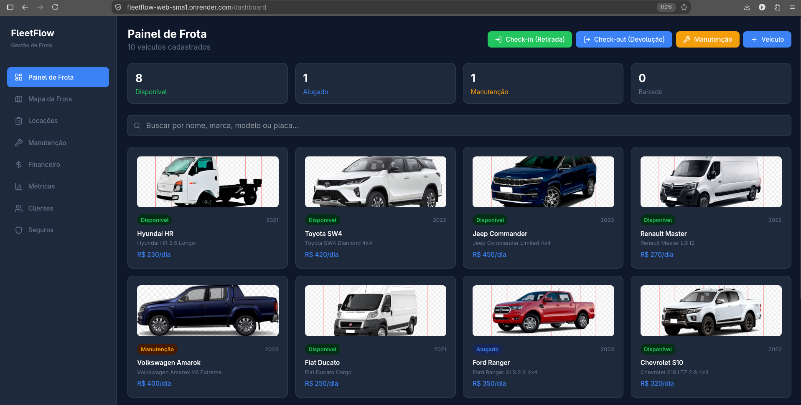
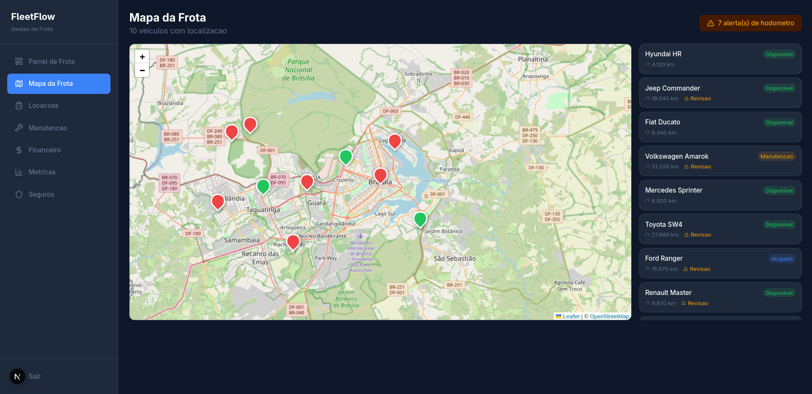
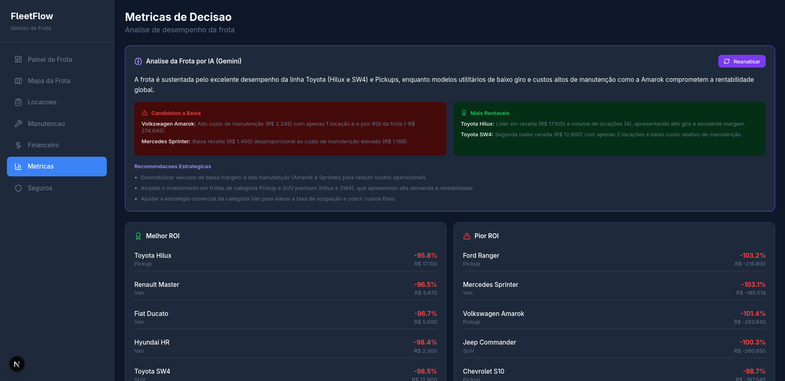
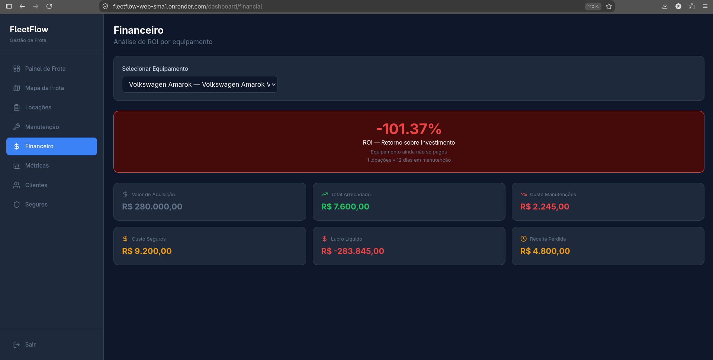
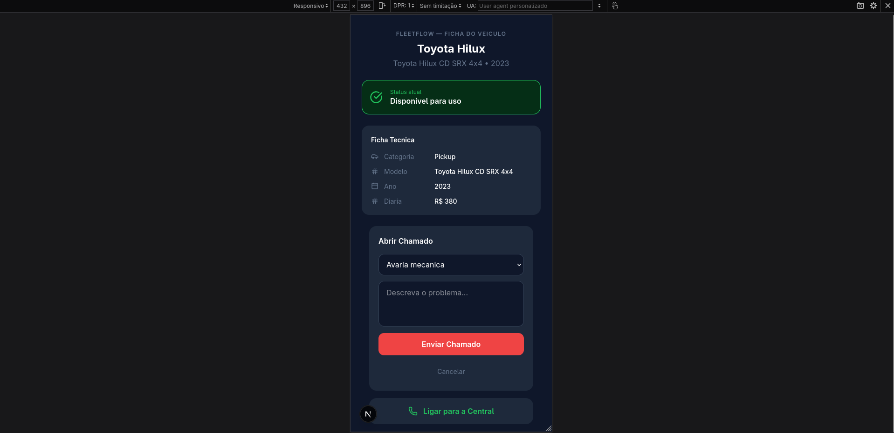

<div align="center">

# FleetFlow (Em construcao)

**Sistema de gestao de frota de veiculos para locacao**

[](LICENSE)
[](https://nodejs.org)
[](https://nextjs.org)
[](https://www.typescriptlang.org)
[](https://www.postgresql.org)
[](https://aistudio.google.com)

</div>

---

## Sobre o Projeto

FleetFlow é um sistema full-stack de gestão de frota de veículos para empresas de locação.
Cobre o ciclo de vida completo de cada veículo: da aquisição ao descarte, passando por
locações, manutenções, seguros e análise de ROI.

O sistema inclui rastreamento GPS simulado com mapa interativo, análise preditiva por IA
(Gemini 3.6 Flash), página pública via QR Code para operadores de pátio e alertas
automáticos de hodômetro.

> **Projeto de portfólio** desenvolvido com a mesma seriedade de um produto comercial:
> arquitetura em módulos, documentação de decisões técnicas e dados realistas de demonstração.

## Telas do Sistema

### Painel de Frota

*Grid visual com fotos reais dos veículos, badges de status em tempo real e ações rápidas
de check-in, check-out e manutenção.*

### Mapa da Frota (Telemetria GPS)

*Mapa interativo com posição de todos os veículos em Brasília/DF, alertas de hodômetro
e detalhe ao clicar no marker.*

### Métricas e Análise por IA

*Gemini 3.6 Flash analisa os dados da frota e entrega recomendações estratégicas:
candidatos à baixa, veículos mais rentáveis e ações prioritárias.*

### Dashboard Financeiro

*ROI individual por veículo com receita total, custo de manutenção, custo de seguro,
lucro líquido e receita perdida por downtime.*

### Página Pública via QR Code

*Página responsiva acessada via QR Code sem autenticação: ficha técnica, status atual
e formulário de abertura de chamado direto do campo.*

---

## Funcionalidades

| Módulo | Descrição |
|--------|-----------|
| Painel de Frota | Grid visual com fotos, badges de status, busca e filtros |
| Check-in / Check-out | Retirada e devolução de veículos com registro de condições |
| Manutenção | Preventiva e corretiva com OS, peças, custos e liberação |
| Financeiro | ROI por veículo: receita, custos, lucro líquido, downtime |
| Métricas | Rankings, taxa de ocupação, custo por categoria |
| Telemetria GPS | Mapa interativo, hodômetro, alertas e gatilho automático de OS |
| Seguros | Apólices, sinistros e alertas de vencimento |
| IA (Gemini) | Análise preditiva da frota e recomendações estratégicas |
| QR Code | Página pública com ficha técnica e abertura de chamado |
| Upload de Fotos | Galeria por veículo com visualização e remoção |

---

## Stack

**Backend:** Node.js 20 + Express + TypeScript + Prisma 5 + PostgreSQL 16

**Frontend:** Next.js 16 + Tailwind CSS + TypeScript + React Leaflet

**IA:** Google Gemini 3.6 Flash

**Infra:** Docker + Docker Compose

---

## Como rodar localmente

### Pré-requisitos
- Node.js 20+
- Docker e Docker Compose
- gh CLI (para primeiro setup)

### Passos

```bash
# 1. Clone e instale
git clone https://github.com/fernandogrimello/fleetflow.git
cd fleetflow

# 2. Suba o banco
docker-compose up -d postgres

# 3. Configure variaveis de ambiente
cp apps/api/.env.example apps/api/.env
# Edite apps/api/.env com suas credenciais

# 4. Execute as migrations e seed
cd apps/api
npx prisma migrate dev
docker exec -i fleetflow_postgres psql -U fleetflow -d fleetflow_db < prisma/seed.sql

# 5. Inicie os servidores
npm run dev                  # backend na porta 3001
cd ../web && npm run dev     # frontend na porta 3000
```

Acesse: http://localhost:3000

---

## Estrutura do Projeto
fleetflow/
├── apps/
│ ├── api/ # Backend Node.js/Express/Prisma
│ └── web/ # Frontend Next.js
├── docs/
│ ├── screenshots/ # Capturas de tela do sistema
│ └── *.md # Documentacao de arquitetura
├── prisma/ # Schema e migrations
└── docker-compose.yml

---

## Documentacao

| Arquivo | Conteudo |
|---------|----------|
| [01-arquitetura.md](docs/01-arquitetura.md) | Visão geral e decisões de design |
| [02-banco-de-dados.md](docs/02-banco-de-dados.md) | Modelo de dados e relacionamentos |
| [03-modulos.md](docs/03-modulos.md) | Detalhamento funcional |
| [04-decisoes-tecnicas.md](docs/04-decisoes-tecnicas.md) | ADRs |
| [05-problemas-e-solucoes.md](docs/05-problemas-e-solucoes.md) | Challenges log |

---

## Projetos Relacionados

- [ops-ai-agent](https://github.com/fernandogrimello/ops-ai-agent) — Atendimento via WhatsApp com criacão de tickets (mesma stack)

---

## Licenca

Este repositório é disponibilizado apenas para visualizacão de portfolio.
Uso, cópia ou redistribuicão não autorizados. Ver [LICENSE](LICENSE).

(c) 2026 Fernando Grimello
